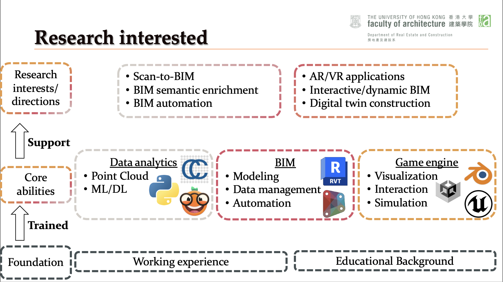

Hi, my name is CHEN, Sou-Han, or can simply called my Hank. 

I am currently working as a research assistant at [The University of Hong Kong](https://www.hku.hk), [Faculty of Architecture](https://www.arch.hku.hk), [Department of Real Estate and Construction](https://www.arch.hku.hk/departments-and-divisions/department-of-real-estate-and-construction/), [iLab](https://ilab.hku.hk), under [Dr.Frank](https://frankxue.com)'s supervision. 

My research interest is:

# Programming skills: 
* Python
* C# (mainly for Unity usage)

# Software:
* BIM-related: 
    * AutoCAD, Revit, Dynamo, Naviswork, Vectorworks
* Game engine:
    * Blender, Unity, Unreal Engine, TwinMotion
* Data analytics:
    * CloudCompare, Orange Data Mining, Tableau
* Microsoft:
    * Office, Visio, Project
* Adobe:
    * Indesign, Illustrator, After Effects, Premiere
* Others: 
    * Qualtrics, AppSheet

# Languages:
* Chinese (Mandarin & Cantonese)
* English