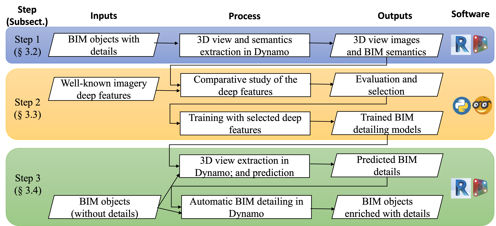

# Automatic BIM detailing using deep features of 3D views

Abstract:
Building information modeling (BIM) detailing, the process of adding the level of graphical and non-graphical details, is required in many BIM stages and applications; however, manual BIM detailing is a resource-intensive and costly process. This study proposes an automatic BIM detailing method based on deep features (DFs) of BIM 3D views in three steps. First, a BIM’s 3D view and semantics were extracted automatically. Then, machine learning (ML) algorithms learned the DFs to predict the target BIM’s invisible details. Finally, the details were automatically added to BIM by a Dynamo program. A case study of motion-bearing component detailing for 86 doors through three DFs and five ML algorithms revealed that DFs improved the automatic detailing results comprehensively (29 out of 32 scenarios) and significantly. This paper’s contribution includes an effective, novel approach for automatic BIM detailing as well as quantified experimental evidence about the effectiveness of DFs for BIM applications.

**Automation in Construction** *Volume 148, April 2023, 104780*

Doi: [10.1016/j.autcon.2023.104780](https://www.sciencedirect.com/science/article/abs/pii/S0926580523000407?via%3Dihub)

