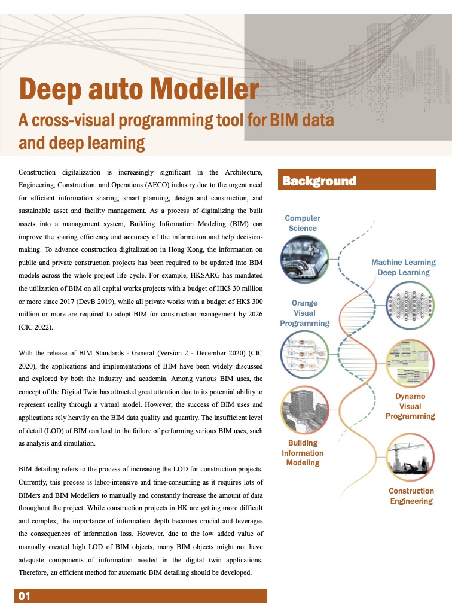
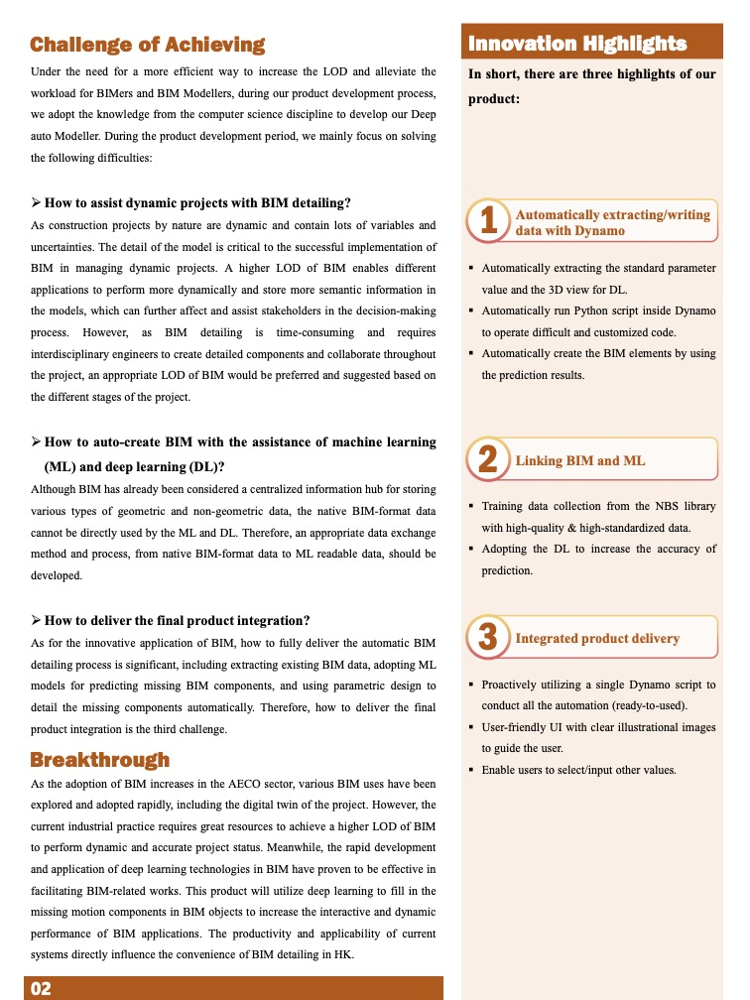
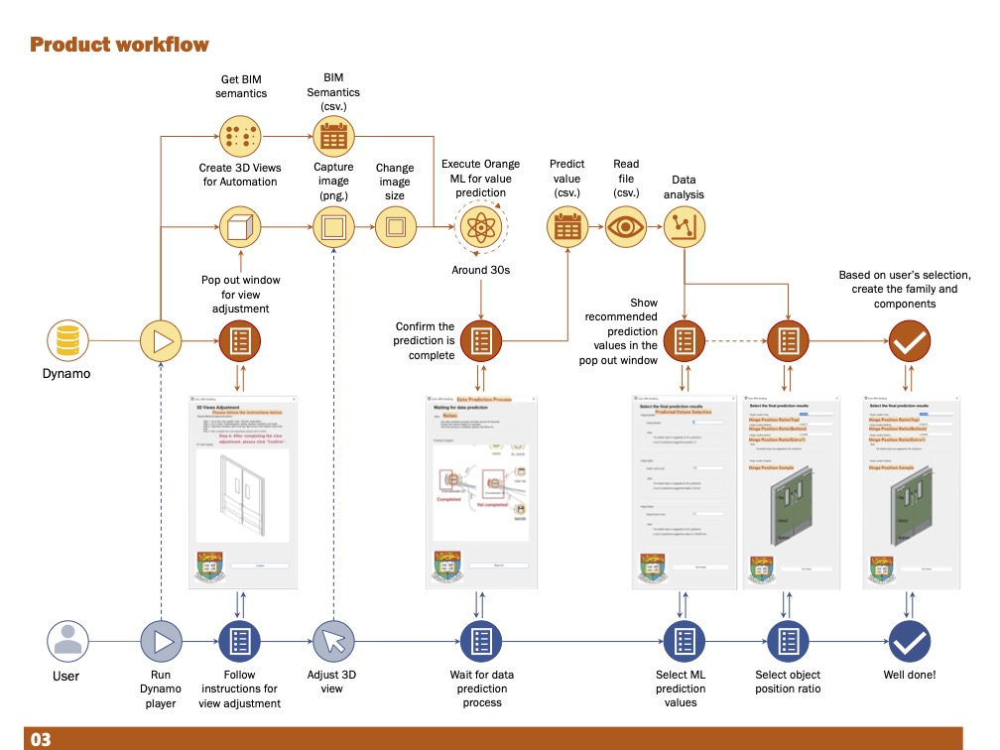
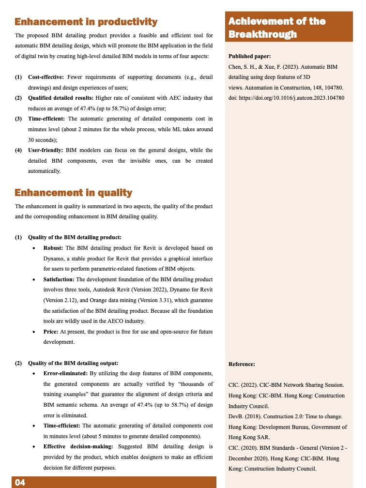

# HKIBIM BIM Automation Arena Background

HKIBIM is now making its first attempt to host an automation arena to gather talents and facilitate new development of the construction industry. BIM professionals or IT talents are welcome to submit their digital solutions which can further improve construction project management quality and effectiveness in the following aspects, including design and documentation, visualization and collaboration, and interoperability and data exchange. Winners could enjoy various media coverage offered by the organizer.  Let’s manifest your breakthrough and exchange ideas in BIM automation.

More information please visit [here](https://www.hkibim.org/index.php?mid=53)

# Honourable Mention Project: Deep auto modeler

The project title is "Deep auto Modeller: A cross-visual programming tool for BIM data and deep learning" aiming to adopt deep learning for facilitating the process of BIM detailing. For more details, please see the below posters. 

Project participator:
* [Dr. Fan Xue](https://frankxue.com) (Assistant Professor) 
* Sou Han CHEN (research assistant)
* Qianyun Zhou (research assistant)
* Lingming Kong (PhD Year 1 student)
* Zhe Chen (PhD Year 1 student)

