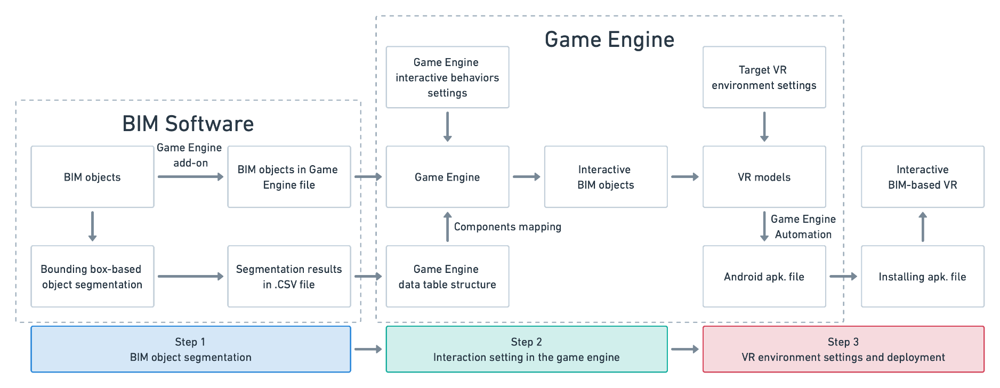
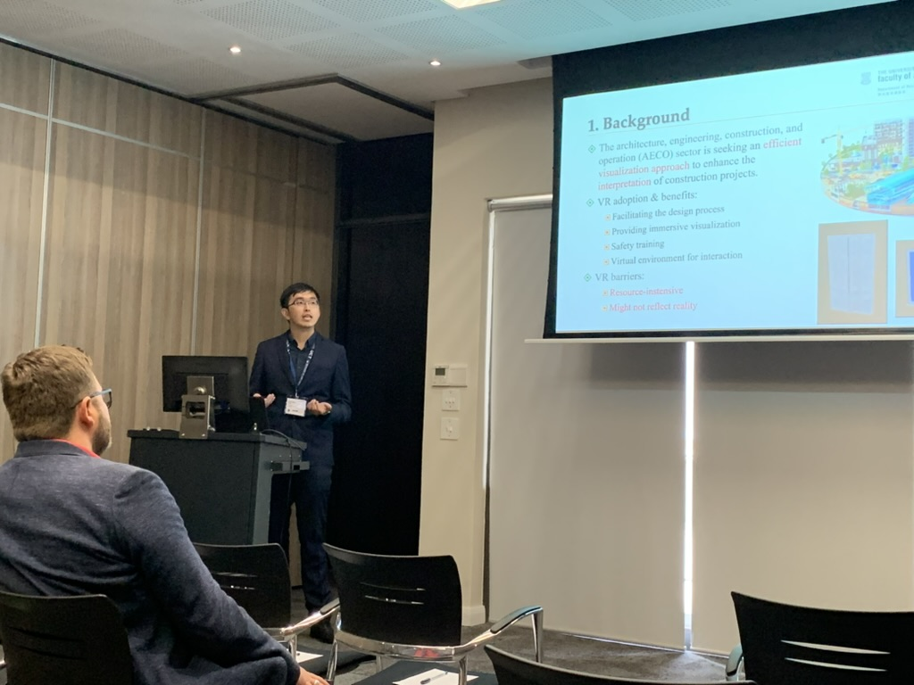

# ICCCBE 2023 @ Cape Town
The International Conference on Computing in Civil and Building Engineering (ICCCBE) is a bi-annually run conference series focusing on information technology in civil and building engineering. The conference provides a unique opportunity for professionals and researchers who are interested in computing in a wide range of civil and building engineering disciplines to come together. These conference series are auspiced by the International Society for Computing in Civil and Building Engineering (ISCCBE).

More information, please visit [here](http://icccbe.org)

# Paper: Interactive BIM-based VR A case study of doors

Abstract:
The adoption of virtual reality (VR) in the construction industry provides an immersive experience for users to view and interact with Building information modeling (BIM). However, in the current practice, the VR experience is created manually, which is time-consuming and does not refer to other validated data. This study proposes an automatic BIM to interactive VR method based on Revit and Unreal Engine in three steps. First, a bounding box-based segmentation is conducted in Revit through Dynamo for classifying the motion-bearing components. Then the BIM along with the segmentation results are imported to Unreal Engine for components mapping and interactive behavior selection. Finally, Oculus Quest presents an interactive BIM-based VR experience to users. A case study of BIM doors was conducted to validate the pro-posed method. In the output VR models, users can control and interact with swing doors through the touch controller of the VR headset. Four interactive behaviors of the door were realized for interactive and experiencing user interactions. The findings confirmed the feasibility as well as automation of the proposed method, for faster BIM-to-VR content creation.

